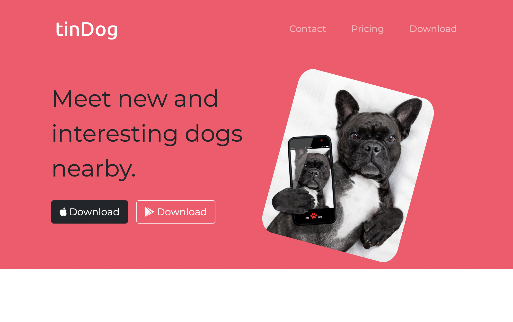

# tinDog-website

Small front-end web development project from Udemy course (2022 Web Development Bootcamp by Dr. Angela Yu). 

This project is aimed at learning and developing a website page using HTML, CSS, and bootstrap, as well as, learning concepts of web development. 

**Sample Webpage**

